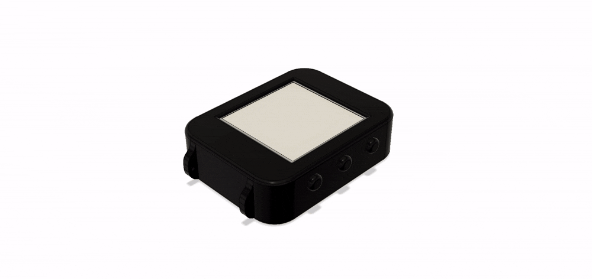
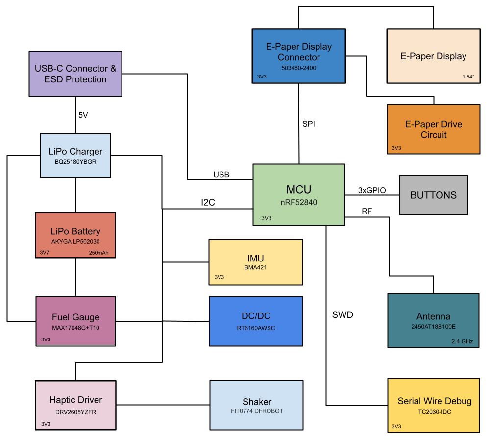

# InkTime Smartwatch

 
 

## Block Diagram

 
 

## Bill of Materials(BOM)

| Name | Component Type | Part Number | Qty | JLCPCB Part Link | Datasheet Link|
|----------|----------|------------|-----|----------------|-----------|
| ANT1 | Antenna | 2450AT18B100E | 1 | [View Part](https://jlcpcb.com/partdetail/JohansonDielectrics-2450AT18B100E/C2917717) | [View Datasheet](https://www.lcsc.com/datasheet/C2917717.pdf?spm=wm.sxq.inf.ggs___wm.ssy.bg.0.xh&lcsc_vid=RVILV1QAFgMLXlRXRFQPBVVeFgVaXwJQTwdfAlJXFAUxVlNRQVReVFZST1FWUDsOAxUeFF5JWBYZEEoKFBINSQcJGk4%3D) |
| C1, C2, C17, C18 | Capacitor | GRM0335C1H120JA01D | 4 | [View Part](https://jlcpcb.com/partdetail/MurataElectronics-GRM0335C1H120JA01D/C85890) | [View Datasheet](https://www.lcsc.com/datasheet/C85890.pdf?spm=wm.sxq.inf.ggs___wm.ssy.bg.0.xh&lcsc_vid=RVILV1QAFgMLXlRXRFQPBVVeFgVaXwJQTwdfAlJXFAUxVlNRQVReVFZQQFRdUzsOAxUeFF5JWBYZEEoKFBINSQcJGk4eFQsCAgIaSgADAwAHC0slRVhfUFNXQE8GEwkK) |
| C1-EP-DR, C24, C39 | Capacitor | GRM155R60J106ME44D | 3 | [View Part](https://jlcpcb.com/partdetail/MurataElectronics-GRM155R60J106ME44D/C76991) | [View Datasheet](https://www.lcsc.com/datasheet/C76991.pdf?spm=wm.sxq.inf.ggs___wm.ssy.bg.0.xh&lcsc_vid=RVILV1QAFgMLXlRXRFQPBVVeFgVaXwJQTwdfAlJXFAUxVlNRQVReVFdWQ1NfVTsOAxUeFF5JWBYZEEoKFBINSQcJGk4eFQsCAgIaSgADAwAHC0slT1RWXlRIHxUDCw%3D%3D) |
| C2-EP-DR | Capacitor | RVT1E4R7M0405 | 1 | [View Part](https://jlcpcb.com/partdetail/DMBJ-RVT1E4R7M0405_4_7UF25V/C970600) | [View Datasheet](https://www.lcsc.com/datasheet/C2895731.pdf?spm=wm.sxq.inf.ggs___wm.ssy.bg.0.xh&lcsc_vid=RVILV1QAFgMLXlRXRFQPBVVeFgVaXwJQTwdfAlJXFAUxVlNRQVReVFdRRVlcUjsOAxUeFF5JWBYZEEoKFBINSQcJGk4eFQsCAgIaSgADAwAHC0slRVlXUlNVRk8GEwkK) |
| C3, C4 | Capacitor | GRM0335C1H1R0BA01D | 2 | [View Part](https://jlcpcb.com/partdetail/MurataElectronics-GRM0335C1H1R0BA01D/C85893) | [View Datasheet](https://www.lcsc.com/datasheet/C85893.pdf?spm=wm.sxq.inf.ggs___wm.ssy.bg.0.xh&lcsc_vid=RVILV1QAFgMLXlRXRFQPBVVeFgVaXwJQTwdfAlJXFAUxVlNRQVReVFFVTlldVzsOAxUeFF5JWBYZEEoKFBINSQcJGk4dAgUUFAk%3D) |
| C5, C7, C8, C12, C19 | Capacitor | GRM033R60J104KE19D | 5 | [View Part](https://jlcpcb.com/partdetail/MurataElectronics-GRM033R60J104KE19D/C76928) | [View Datasheet](https://www.lcsc.com/datasheet/C76928.pdf?spm=wm.sxq.inf.ggs___wm.ssy.bg.0.xh&lcsc_vid=RVILV1QAFgMLXlRXRFQPBVVeFgVaXwJQTwdfAlJXFAUxVlNRQVReVFJTQlJcVDsOAxUeFF5JWBYZEEoKFBINSQcJGk4eFQsCAgIaSgADAwAHC0slRVlXUlNVRk8GEwkK) |
| C6, C14, C20, C21, C43 | Capacitor | GRM155R60J475KE96D | 5 | [View Part](https://jlcpcb.com/partdetail/MurataElectronics-GRM155R60J475KE96D/C76995) | [View Datasheet](https://www.lcsc.com/datasheet/C76995.pdf?spm=wm.sxq.inf.ggs___wm.ssy.bg.0.xh&lcsc_vid=RVILV1QAFgMLXlRXRFQPBVVeFgVaXwJQTwdfAlJXFAUxVlNRQVReVFNRR1VbVjsOAxUeFF5JWBYZEEoKFBINSQcJGk4dAgUUFAk%3D) |
| C9 | Capacitor | GRM033R71E821KA01D | 1 | [View Part](https://jlcpcb.com/partdetail/197002-GRM033R71E821KA01D/C185597) | [View Datasheet](https://www.lcsc.com/datasheet/C185597.pdf?spm=wm.sxq.inf.ggs___wm.ssy.bg.0.xh&lcsc_vid=RVILV1QAFgMLXlRXRFQPBVVeFgVaXwJQTwdfAlJXFAUxVlNRQVReVFxTQVVfVjsOAxUeFF5JWBYZEEoKFBINSQcJGk4dAgUUFAk%3D) |
| C11 | Capacitor | GRM0335C1E101JA01D | 1 | [View Part](https://jlcpcb.com/partdetail/MurataElectronics-GRM0335C1E101JA01D/C76917) | [View Datasheet](https://www.lcsc.com/datasheet/C76917.pdf?spm=wm.sxq.inf.ggs___wm.ssy.bg.0.xh&lcsc_vid=RVILV1QAFgMLXlRXRFQPBVVeFgVaXwJQTwdfAlJXFAUxVlNRQVReVF1QQ1JXVzsOAxUeFF5JWBYZEEoKFBINSQcJGk4eFQsCAgIaSgADAwAHC0slRlRfX1ZWT08GEwkK) |
| C15 | Capacitor | GRM155R60J105KE19D | 1 | [View Part](https://jlcpcb.com/partdetail/MurataElectronics-GRM155R60J105KE19D/C15684) | [View Datasheet](https://www.lcsc.com/product-detail/C15684.html?s_z=n_q_GRM155R60J105KE19D&spm=wm.ssy.bg.0.xh&lcsc_vid=RVILV1QAFgMLXlRXRFQPBVVeFgVaXwJQTwdfAlJXFAUxVlNRQVReU1ZQR1NbVTsOAxUeFF5JWBYZEEoKFBINSQcJGk4dAgUUFAk%3D) |
| C16, C10, C13, C22 | Capacitor | GRM033R60J473KE19D | 4 | [View Part](https://jlcpcb.com/parts/componentSearch?searchTxt=GRM033R60J473KE19D) | [View Datasheet](https://www.lcsc.com/product-detail/C85925.html?s_z=n_q_GRM033R60J473KE19D&spm=wm.ssy.bg.0.xh&lcsc_vid=RVILV1QAFgMLXlRXRFQPBVVeFgVaXwJQTwdfAlJXFAUxVlNRQVReU1RRTlFcUzsOAxUeFF5JWBYZEEoKFBINSQcJGk4dAgUUFAk%3D) |
| C25, C33 | Capacitor | GRM155R60J226ME11D | 2 | [View Part](https://jlcpcb.com/partdetail/408393-GRM155R60J226ME11D/C415703) | [View Datasheet](https://www.lcsc.com/datasheet/C415703.pdf?spm=wm.sxq.inf.ggs___wm.ssy.bg.0.xh&lcsc_vid=RVILV1QAFgMLXlRXRFQPBVVeFgVaXwJQTwdfAlJXFAUxVlNRQVReU1BSQlVdVjsOAxUeFF5JWBYZEEoKFBINSQcJGk4dAgUUFAk%3D) |
| C23, C27, C29, C30, C31, C32, C34, C37, C38, C42| Capacitor | GRM011R60J152KE01L | 10 | [View Part](https://jlcpcb.com/partdetail/22429554-GRM011R60J152KE01L/C21012218) | [View Datasheet](https://www.lcsc.com/datasheet/C21012218.pdf?spm=wm.sxq.inf.ggs___wm.ssy.bg.0.xh&lcsc_vid=RVILV1QAFgMLXlRXRFQPBVVeFgVaXwJQTwdfAlJXFAUxVlNRQVReU1FTRlhfUDsOAxUeFF5JWBYZEEoKFBINSQcJGk4eFQsCAgIaSgADAwAHC0slQFdXXlFIHxUDCw%3D%3D) |
| D2, D4, D5  | Schottky Diode | MBR0530 | 3 | [View Part](https://jlcpcb.com/partdetail/onsemi-MBR0530/C232832) | [View Datasheet](https://www.lcsc.com/datasheet/C232832.pdf?spm=wm.sxq.inf.ggs___wm.ssy.bg.3.xh&lcsc_vid=RVILV1QAFgMLXlRXRFQPBVVeFgVaXwJQTwdfAlJXFAUxVlNRQVReUlVUQlZXXjsOAxUeFF5JWBYZEEoKFBINSQcJGk4eFQsCAgIaSgADAwAHC0slQ1ZbUFVeWQkaCgg%3D) |
| D3 | ESD Protection | USBLC6-2SC6Y | 1 | [View Part](https://jlcpcb.com/partdetail/STMicroelectronics-USBLC62SC6Y/C2969755) | [View Datasheet](https://www.lcsc.com/datasheet/C2969755.pdf?spm=wm.sxq.inf.ggs___wm.ssy.bg.0.xh&lcsc_vid=RVILV1QAFgMLXlRXRFQPBVVeFgVaXwJQTwdfAlJXFAUxVlNRQVReUlZVQFReVjsOAxUeFF5JWBYZEEoKFBINSQcJGk4dAgUUFAk%3D) |
| EPD_C1, EPD_C2, EPD_C6–EPD_C12 | Capacitor | 0201WMJ0100TCE | 9 | [View Part](https://jlcpcb.com/partdetail/25795-0201WMJ0100TCE/C25052) | [View Datasheet](https://www.lcsc.com/datasheet/C25052.pdf?spm=wm.sxq.inf.ggs___wm.ssy.bg.0.xh&lcsc_vid=RVILV1QAFgMLXlRXRFQPBVVeFgVaXwJQTwdfAlJXFAUxVlNRQVReUVVSQFBcUjsOAxUeFF5JWBYZEEoKFBINSQcJGk4eFQsCAgIaSgADAwAHC0slRlNcU1dSWQkaCgg%3D) |
| EPD_C5 | Capacitor | 500R07W104KV4T | 1 | [View Part](https://jlcpcb.com/partdetail/6103901-500R07W104KV4T_0_1uF50v/C5337557) | [View Datasheet](https://www.mouser.com/catalog/specsheets/johanson_joha-s-a0008490164-1.pdf?_gl=1*1natqy3*_gcl_aw*R0NMLjE3NzY0NTE3MzMuQ2p3S0NBand0SWZQQmhBekVpd0F2OVJUSnBRX2lCajR0MlBzNHZ5MExvUnpFdC1mTmpicTQwR0hYM3ZmV1lEa1JYZ2ZDUGdWczVxMHBob0MyMXdRQXZEX0J3RQ..*_gcl_au*MTQ2MTI4OTM2Mi4xNzc2NDUxNjg3LjE4ODk2NzQyODAuMTc3NjUwMjIwNy4xNzc2NTAyNzAz*_ga*MTg0MjYwMjQxLjE3NzY0NTE2ODc.*_ga_15W4STQT4T*czE3NzY1MDYyOTckbzQkZzEkdDE3NzY1MDYzNjEkajYwJGwwJGgw) |
| IC1 | LiPo Charger | BQ25180YBGR | 1 | [View Part](https://jlcpcb.com/partdetail/TexasInstruments-BQ25180YBGR/C3682423) | [View Datasheet](https://www.ti.com/cn/lit/gpn/bq25180) |
| IC2 | Haptic Driver | DRV2605YZFR | 1 | [View Part](https://jlcpcb.com/partdetail/TexasInstruments-DRV2605YZFR/C81079) | [View Datasheet](https://www.lcsc.com/datasheet/C81079.pdf?spm=wm.sxq.inf.ggs___wm.ssy.bg.0.xh&lcsc_vid=RVILV1QAFgMLXlRXRFQPBVVeFgVaXwJQTwdfAlJXFAUxVlNRQVReUldeQ1RfVjsOAxUeFF5JWBYZEEoKFBINSQcJGk4eFQsCAgIaSgADAwAHC0slQ1BbUFRVWQkaCgg%3D) |
| IC3 | IMU | BMA421 | 1 | [View Part](https://jlcpcb.com/partdetail/BoschSensortec-BMA421/C5242966) | [View Datasheet](https://files.pine64.org/doc/datasheet/pinetime/BST-BMA421-FL000.pdf) |
| IC9 | DC/DC Converter | RT6160AWSC | 1 | [View Part](https://jlcpcb.com/partdetail/RichtekTech-RT6160AWSC/C7065276) | [View Datasheet](https://www.lcsc.com/datasheet/C7065276.pdf?spm=wm.sxq.inf.ggs___wm.ssy.bg.0.xh&lcsc_vid=RVILV1QAFgMLXlRXRFQPBVVeFgVaXwJQTwdfAlJXFAUxVlNRQVReUlFfQVZbUTsOAxUeFF5JWBYZEEoKFBINSQcJGk4dAgUUFAk%3D) |
| J1 | FPC Connector | 503480-2400 | 1 | [View Part](https://jlcpcb.com/partdetail/MOLEX-5034802400/C122434) | [View Datasheet](https://www.lcsc.com/datasheet/C122434.pdf?spm=wm.sxq.inf.ggs___wm.ssy.bg.0.xh&lcsc_vid=RVILV1QAFgMLXlRXRFQPBVVeFgVaXwJQTwdfAlJXFAUxVlNRQVReUlJeQ1JeVzsOAxUeFF5JWBYZEEoKFBINSQcJGk4dAgUUFAk%3D) |
| J2 | Debug Connector | TC2030-IDC | 1 | - | [View Datasheet](https://www.tag-connect.com/wp-content/uploads/bsk-pdf-manager/2019/12/TC2030-IDC-Datasheet-Rev-B.pdf) |
| J4 | USB-C Connector | KH-TYPE-C-16P | 1 | [View Part](https://jlcpcb.com/partdetail/Shenzhen_KinghelmElec-KH_TYPE_C16P/C709357) | [View Datasheet](https://www.lcsc.com/datasheet/C709357.pdf?spm=wm.sxq.inf.ggs___wm.ssy.bg.0.xh&lcsc_vid=RVILV1QAFgMLXlRXRFQPBVVeFgVaXwJQTwdfAlJXFAUxVlNRQVReUlNQQldXVDsOAxUeFF5JWBYZEEoKFBINSQcJGk4eFQsCAgIaSgADAwAHC0slRFdWVVBURE8GEwkK) |
| L1 | Inductor | LQG15HS3N9S02D | 1 | [View Part](https://jlcpcb.com/partdetail/MurataElectronics-LQG15HS3N9S02D/C77109) | [View Datasheet](https://www.lcsc.com/datasheet/C77109.pdf?spm=wm.sxq.inf.ggs___wm.ssy.bg.0.xh&lcsc_vid=RVILV1QAFgMLXlRXRFQPBVVeFgVaXwJQTwdfAlJXFAUxVlNRQVReUVBfQVJdVjsOAxUeFF5JWBYZEEoKFBINSQcJGk4dAgUUFAk%3D) |
| L2 | Inductor | LQW15DN100M00D | 1 | [View Part](https://jlcpcb.com/partdetail/MurataElectronics-LQW15DN100M00D/C910650) | [View Datasheet](https://www.lcsc.com/datasheet/C910650.pdf?spm=wm.sxq.inf.ggs___wm.ssy.bg.0.xh&lcsc_vid=RVILV1QAFgMLXlRXRFQPBVVeFgVaXwJQTwdfAlJXFAUxVlNRQVReUVJXR1BdVjsOAxUeFF5JWBYZEEoKFBINSQcJGk4eFQsCAgIaSgADAwAHC0slRVReUlZIHxUDCw%3D%3D) |
| L3 | Inductor | LQG15HS15NJ02D| 1 | [View Part](https://jlcpcb.com/partdetail/MurataElectronics-LQG15HS15NJ02D/C86059) | [View Datasheet](https://www.lcsc.com/datasheet/C86059.pdf?spm=wm.sxq.inf.ggs___wm.ssy.bg.0.xh&lcsc_vid=RVILV1QAFgMLXlRXRFQPBVVeFgVaXwJQTwdfAlJXFAUxVlNRQVReUVJfRlJaVzsOAxUeFF5JWBYZEEoKFBINSQcJGk4dAgUUFAk%3D) |
| L5 | Inductor | LQG15HS27NJ02D | 1 | [View Part](https://jlcpcb.com/partdetail/MurataElectronics-LQG15HS27NJ02D/C12669) | [View Datasheet](https://www.lcsc.com/datasheet/C12669.pdf?spm=wm.sxq.inf.ggs___wm.ssy.bg.0.xh&lcsc_vid=RVILV1QAFgMLXlRXRFQPBVVeFgVaXwJQTwdfAlJXFAUxVlNRQVReUVNVR1hcXzsOAxUeFF5JWBYZEEoKFBINSQcJGk4dAgUUFAk%3D) |
| L7 | Inductor | LQW15CNR47K10D| 1 | [View Part](https://jlcpcb.com/partdetail/MurataElectronics-LQW15CNR47K10D/C913544) | [View Datasheet](https://www.lcsc.com/datasheet/C913544.pdf?spm=wm.sxq.inf.ggs___wm.ssy.bg.0.xh&lcsc_vid=RVILV1QAFgMLXlRXRFQPBVVeFgVaXwJQTwdfAlJXFAUxVlNRQVReUVNRT1dbVjsOAxUeFF5JWBYZEEoKFBINSQcJGk4eFQsCAgIaSgADAwAHC0slQFZfV11IHxUDCw%3D%3D) |
| Q1 | P-Channel MOSFET | DMG2305UX-7 | 1 | [View Part](https://jlcpcb.com/partdetail/DiodesIncorporated-DMG2305UX7/C150470) | [View Datasheet](https://www.lcsc.com/datasheet/C150470.pdf?spm=wm.sxq.inf.ggs___wm.ssy.bg.0.xh&lcsc_vid=RVILV1QAFgMLXlRXRFQPBVVeFgVaXwJQTwdfAlJXFAUxVlNRQVReUVxRQFhXUzsOAxUeFF5JWBYZEEoKFBINSQcJGk4dAgUUFAk%3D) |
| Q3 | N-Channel MOSFET | SI1308EDL-T1-GE3 | 1 | [View Part](https://jlcpcb.com/partdetail/VishayIntertech-SI1308EDL_T1GE3/C469327) | [View Datasheet](https://www.lcsc.com/datasheet/C469327.pdf?spm=wm.sxq.inf.ggs___wm.ssy.bg.0.xh&lcsc_vid=RVILV1QAFgMLXlRXRFQPBVVeFgVaXwJQTwdfAlJXFAUxVlNRQVReUVBWQ1VdVDsOAxUeFF5JWBYZEEoKFBINSQcJGk4eFQsCAgIaSgADAwAHC0slQFFYUlZRQU8GEwkK) |
| R_PWR_EPD, R2_EP_DR, R9 | Resistor | CPF0201D10KC1 | 3 | [View Part](https://jlcpcb.com/partdetail/TEConnectivity-CPF0201D10KC1/C4187156) | [View Datasheet](https://www.lcsc.com/datasheet/C4187156.pdf?spm=wm.sxq.inf.ggs___wm.ssy.bg.0.xh&lcsc_vid=RVILV1QAFgMLXlRXRFQPBVVeFgVaXwJQTwdfAlJXFAUxVlNRQVReUFdQR1hYVjsOAxUeFF5JWBYZEEoKFBINSQcJGk4eFQsCAgIaSgADAwAHC0slRlReU1NWWQkaCgg%3D) |
| R_TYPE_SEL | Resistor | RC0201FR-072R2L | 1 | [View Part](https://jlcpcb.com/partdetail/YAGEO-RC0201FR072R2L/C138154) | [View Datasheet](https://www.lcsc.com/datasheet/C138154.pdf?spm=wm.sxq.inf.ggs___wm.ssy.bg.0.xh&lcsc_vid=RVILV1QAFgMLXlRXRFQPBVVeFgVaXwJQTwdfAlJXFAUxVlNRQVReUFBTQlhcVDsOAxUeFF5JWBYZEEoKFBINSQcJGk4dAgUUFAk%3D) |
| R1_EP_DR | Resistor | 25121WF470LT4E | 1 | [View Part](https://jlcpcb.com/partdetail/21809-25121WF470LT4E/C21097) | [View Datasheet](https://www.lcsc.com/datasheet/C21097.pdf?spm=wm.sxq.inf.ggs___wm.ssy.bg.0.xh&lcsc_vid=RVILV1QAFgMLXlRXRFQPBVVeFgVaXwJQTwdfAlJXFAUxVlNRQVReUFJWT1lbVTsOAxUeFF5JWBYZEEoKFBINSQcJGk4dAgUUFAk%3D) |
| R1_USB1, R2_USB | Resistor | RC0201JR-075K1L | 2 | [View Part](https://jlcpcb.com/partdetail/YAGEO-RC0201JR075K1L/C163490) | [View Datasheet](https://www.lcsc.com/datasheet/C163490.pdf?spm=wm.sxq.inf.ggs___wm.ssy.bg.0.xh&lcsc_vid=RVILV1QAFgMLXlRXRFQPBVVeFgVaXwJQTwdfAlJXFAUxVlNRQVReUFJRT1NbUjsOAxUeFF5JWBYZEEoKFBINSQcJGk4dAgUUFAk%3D) |
| R2, R3, R4 | Resistor | RC0201FR-070RL | 3 | [View Part](https://jlcpcb.com/partdetail/YAGEO-RC0201FR070RL/C106227) | [View Datasheet](https://www.lcsc.com/datasheet/C106227.pdf?spm=wm.sxq.inf.ggs___wm.ssy.bg.0.xh&lcsc_vid=RVILV1QAFgMLXlRXRFQPBVVeFgVaXwJQTwdfAlJXFAUxVlNRQVReUFNVQ1NcUTsOAxUeFF5JWBYZEEoKFBINSQcJGk4dAgUUFAk%3D) |
| R5, R7, R8 | Resistor | RC0201FR-0710KL | 3 | [View Part](https://jlcpcb.com/partdetail/YAGEO-RC0201FR0710KL/C106225) | [View Datasheet](https://www.lcsc.com/product-detail/C106225.html?s_z=n_q_RC0201FR-0710KL&spm=wm.ssy.bg.0.xh&lcsc_vid=RVILV1QAFgMLXlRXRFQPBVVeFgVaXwJQTwdfAlJXFAUxVlNRQVReUFxUQFVaUjsOAxUeFF5JWBYZEEoKFBINSQcJGk4eFQsCAgIaSgADAwAHC0slRlJWVlFSWQkaCgg%3D) |
| R17, R18 | Resistor | AC0201FR-073K3L | 2 | [View Part](https://jlcpcb.com/partdetail/YAGEO-AC0201FR073K3L/C226534) | [View Datasheet](https://www.lcsc.com/datasheet/C226534.pdf?spm=wm.sxq.inf.ggs___wm.ssy.bg.0.xh&lcsc_vid=RVILV1QAFgMLXlRXRFQPBVVeFgVaXwJQTwdfAlJXFAUxVlNRQVReUFxRR1hYUTsOAxUeFF5JWBYZEEoKFBINSQcJGk4eFQsCAgIaSgADAwAHC0slRlFYVVZRWQkaCgg%3D) |
| SW_DN, SW_ENT, SW_UP | Button | EVP-AKE31A | 3 | [View Part](https://jlcpcb.com/partdetail/PANASONIC-EVPAKE31A/C569760) | [View Datasheet](https://www.lcsc.com/datasheet/C569760.pdf?spm=wm.sxq.inf.ggs___wm.ssy.bg.0.xh&lcsc_vid=RVILV1QAFgMLXlRXRFQPBVVeFgVaXwJQTwdfAlJXFAUxVlNRQVReUV1VQ1VYVTsOAxUeFF5JWBYZEEoKFBINSQcJGk4eFQsCAgIaSgADAwAHC0slTlBdUlBSWQkaCgg%3D) |
| U1 | MCU | NRF52840-QIAA-R | 1 | [View Part](https://jlcpcb.com/partdetail/NordicSemicon-NRF52840_QIAAR/C190794) | [View Datasheet](https://www.lcsc.com/datasheet/C190794.pdf?spm=wm.sxq.inf.ggs___wm.ssy.bg.0.xh&lcsc_vid=RVILV1QAFgMLXlRXRFQPBVVeFgVaXwJQTwdfAlJXFAUxVlNRQVReUF1RQlJbXzsOAxUeFF5JWBYZEEoKFBINSQcJGk4eFQsCAgIaSgADAwAHC0slRVdWVVJXQU8GEwkK) |
| U3 | Fuel Gauge | MAX17048G+T10 | 1 | [View Part](https://jlcpcb.com/partdetail/2777647-MAX17048GT10/C2682616) | [View Datasheet](https://www.lcsc.com/datasheet/C2682616.pdf?spm=wm.sxq.inf.ggs___wm.ssy.bg.0.xh&lcsc_vid=RVILV1QAFgMLXlRXRFQPBVVeFgVaXwJQTwdfAlJXFAUxVlNRQVReUF1WQVJaXzsOAxUeFF5JWBYZEEoKFBINSQcJGk4eFQsCAgIaSgADAwAHC0slRVBeXlNIHxUDCw%3D%3D) |
| X1 | Crystal | X201232768KJD2SI | 1 | [View Part](https://jlcpcb.com/partdetail/357115-X201232768KJD2SI/C383843) | [View Datasheet](https://www.lcsc.com/datasheet/C383843.pdf?spm=wm.sxq.inf.ggs___wm.ssy.bg.0.xh&lcsc_vid=RVILV1QAFgMLXlRXRFQPBVVeFgVaXwJQTwdfAlJXFAUxVlNRQVReX1FSQlVdUDsOAxUeFF5JWBYZEEoKFBINSQcJGk4eFQsCAgIaSgADAwAHC0slQ1BWUFVTQU8GEwkK) |
| X2 | Crystal | X322532MOB4SI | 1 | [View Part](https://jlcpcb.com/partdetail/YXC_CrystalOscillators-X322532MOB4SI/C9009) | [View Datasheet](https://www.lcsc.com/datasheet/C9009.pdf?spm=wm.sxq.inf.ggs___wm.ssy.bg.0.xh&lcsc_vid=RVILV1QAFgMLXlRXRFQPBVVeFgVaXwJQTwdfAlJXFAUxVlNRQVReX1BTRFhZXjsOAxUeFF5JWBYZEEoKFBINSQcJGk4eFQsCAgIaSgADAwAHC0slRlheUF1SWQkaCgg%3D) |

 
 

## Hardware Functionality
### Overview
The system is built around the **nRF52840 microcontroller**, which controls all peripherals and manages communication between them. The design is centered on low power consumption and efficient interaction between modules.

 

### Power Management
- Power is supplied through the **USB-C connector**, protected by an **ESD protection circuit**.  
- The input voltage is managed by the **LiPo charger**, which charges the battery and provides power to the system.
- A **DC/DC converter** generates a stable voltage of **3.3V** used by all components, ensuring consistent operation regardless of battery level.
- The **Fuel Gauge** monitors battery status and provides charge information to the MCU.

 

### Communication Interfaces
- **I2C Bus**
  - Used by: IMU, Fuel Gauge, Haptic Driver, LiPo Charger  
  - Provides communication over shared **SDA** and **SCL** lines  
  - Allows multiple low-speed peripherals to be connected on the same bus  
  - Operates at standard or fast mode speeds, sufficient for sensor data and status monitoring  

- **SPI Bus**
  - Used by: E-Paper Display  
  - Enables fast data transfer required for updating the display  
  - Uses dedicated lines for clock and data, allowing higher throughput compared to I2C  

- **USB**
  - Used for power input and battery charging  
  - Can also be used for firmware upload or data communication if needed  

- **SWD**
  - Used for programming and debugging  
  - Provides direct access to the microcontroller for firmware flashing and real-time debugging

 

### Display
- The **E-Paper display** is connected via an FPC connector and controlled through the SPI interface.  
- A dedicated **E-Paper driver circuit** manages the display operation.
- E-paper technology only consumes power while refreshing the image, which makes it well suited for low-power applications. To take full advantage of this, the display is powered through a controlled power switch, allowing it to be completely turned off when not actively used. This approach significantly reduces overall power consumption and extends battery life, especially in scenarios where the display content does not need to be updated frequently.

 

### Sensors and Feedback Systems
- **IMU**  
  - The IMU is an accelerometer that is used for motion detection and activity tracking. 
  - It detects movement, orientation, steps and it can generate interrupts so the microcontroller only wakes up when needed, improving power efficiency.

- **Haptic Driver & Shaker**  
  - The haptic driver controls a vibration motor that provides user feedback. 
  - It is configured through I2C and can trigger predefined vibration patterns for notifications.

 

### User Inputs
- **Buttons**  
  - The buttons are connected to GPIO pins and are used to detect user actions. 
  - They can trigger interrupts, allowing the system to wake from low-power states and respond quickly.

 

### Wireless Connectivity
- **Antenna**  
  - The antenna is connected to the microcontroller's RF pin and is used for Low Energy communication via Bluetooth.
  - It enables wireless data exchange with external devices such as smartphones.

 

### Debug Interface
- **Serial Wire Debug (SWD)**  
  - The SWD interface is used for programming and debugging the system during development. 
  - It provides direct access to the microcontroller for firmware upload and troubleshooting.

 
 

## MCU Pin Assignment
| Pin Names            | Purpose                                                                 | Target Component              |
|----------------------|-------------------------------------------------------------------------|-------------------------------|
| DEC1-DEC6, DEC3V3    | Decoupling pins for stable internal power                               | External Decoupling Capacitors|
| P0.00/XL1, P0.01/XL2 | Used to connect external 32.768 kHz Crystal Oscillator (X2)             | X2 Crystal Oscillator         |
| P0.26                | Unused                                                                  | Not connected                 |
| P0.27                | Unused                                                                  | Not connected                 |
| P0.04/AIN2           | Unused                                                                  | Not connected                 |
| P0.05/AIN3           | Chip Select (CS) - Enables communication with the display controller    | E-Paper Display               |
| P0.06, P0.07         | SDA & SCL - Used as shared I2C communication lines for connected devices| IMU, Fuel Gauge, Haptic Driver, LiPo Charger |
| P0.08, P1.08         | Used to receive interrupt signals from the accelerometer                | IMU                           |
| P1.09                | Unused                                                                  | Not connected                 |
| P0.11                | PMIC Interrupt - Indicates charging or power events                     | LiPo Charger                  |
| P0.12                | Haptic Enable: Sends a signal to activate the vibration motor           | Haptic Driver                 |
| VDD, VDDH            | Supply power to the system                                              | DC/DC Converter               |
| DCCH                 | Unused                                                                  | Not connected                 |
| VBUS                 | Detects when USB power is present                                       | USB-C Connector               |
| D-, D+               | Carry USB data signals for communication                                | USB-C Connector               |
| P0.13, P0.14, P1.02  | Connected to physical buttons for user input                            | Buttons                       |
| P0.15, P0.16, P0.17  | Used to control the display by selecting data or commands, resetting it when needed and checking if it is busy during updates | E-Paper Display |
| P0.18/RESET          | Hardware reset signal                                                   | Reset Circuit                 |
| P0.19                | Unused                                                                  | Not connected                 |
| P0.20                | Unused                                                                  | Not connected                 |
| P0.21                | Unused                                                                  | Not connected                 |
| P0.22                | Unused                                                                  | Not connected                 |
| P0.23                | Unused                                                                  | Not connected                 |
| P0.24                | Unused                                                                  | Not connected                 |
| P0.25                | Unused                                                                  | Not connected                 |
| P1.00                | Used for Serial Wire Output to send debug and trace data during development | Debug Interface (SWO)   |
| VSS, VSS_PAD, VSS_PA | Ground connections                                                     | Main Ground Plane             |
| XC1, XC2             | Provide the main high-frequency clock for the system and radio         | X1 Crystal Oscillator         |
| ANT                  | Connects the RF signal to the antenna                                   | Antenna                       |
| P0.10/NFC2           | Fuel Gauge Alert - Signals low battery                                  | Fuel Gauge                    |
| P0.09/NFC1           | Unused                                                                  | Not connected                 |
| P1.07                | Unused                                                                  | Not connected                 |
| P1.06                | Unused                                                                  | Not connected                 |
| P1.05                | Unused                                                                  | Not connected                 |
| P1.04                | Unused                                                                  | Not connected                 |
| P1.03                | Unused                                                                  | Not connected                 |
| P1.01                | Controls the power to the e-paper display by turning it on or off to save battery | E-Paper Power Switch (Q1 MOSFET) |
| SWDIO, SWDCLK        | Used for programming and debugging through the SWD interface           | Debug Port                    |
| DCC                  | Output from internal voltage regulators                                | LC Filter Circuit                        |
| P0.31/AIN7           | Unused                                                                  | Not connected                 |
| P0.30/AIN6           | Unused                                                                  | Not connected                 |
| P0.29/AIN5           | Unused                                                                  | Not connected                 |
| P0.28/AIN4           | Unused                                                                  | Not connected                 |
| P0.02/AIN0           | SPI Clock (SCK) - Synchronizes data sent to the display                | E-Paper Display               |
| P0.03/AIN1           | SPI Data Line (MOSI) -      Sends data to the display                  | E-Paper Display               |
| P1.15                | Unused                                                                  | Not connected                 |
| P1.14                | Unused                                                                  | Not connected                 |
| P1.13                | Unused                                                                  | Not connected                 |
| P1.12                | Unused                                                                  | Not connected                 |
| P1.11                | Unused                                                                  | Not connected                 |
| P1.10                | Unused                                                                  | Not connected                 |
